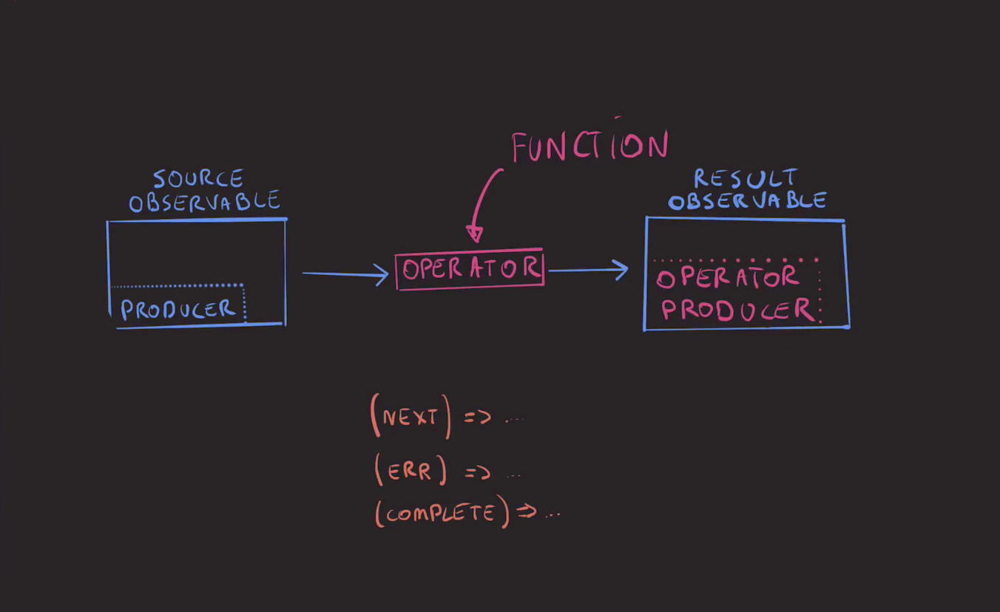
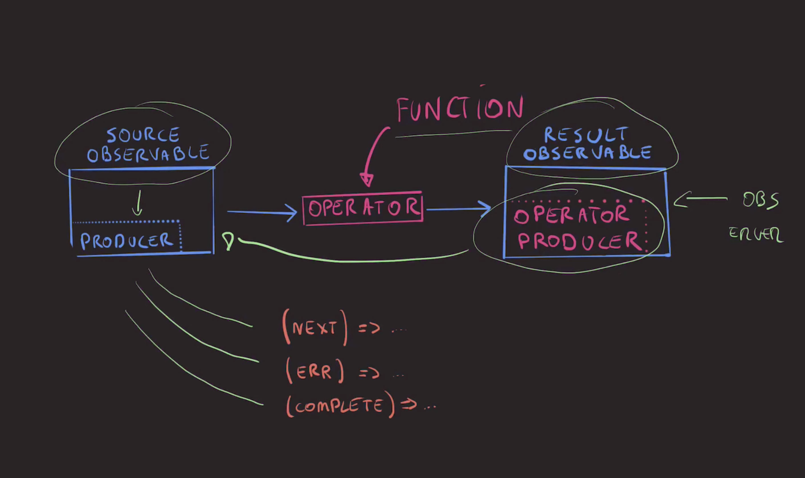

# Observable in depth

## Observable / Observer

```ts
interface MyObserver<T>
{
    next: (n: T) => void;
    error: (err: any) => void;
    complete: () => void;
}

class MyObservable<T>
{
    constructor(private producer: (observer: MyObserver<T>) => void) {}

	// Lazy evaluation : only used while subscribed
    subscribe(observer: MyObserver<T>)
    {
        this.producer( observer );//<-- Pass the observer to the data source producer. Closure will do the rest !
    }
}

const obs$ = new MyObservable<number>
(
	observer: MyObserver<number> => 
	{
	    observer.next(1);
	    setTimeout(() => observer.next(2), 20);
	    setTimeout(() => observer.error('error'), 40);
	}
);

obs$.subscribe
(
	{
    next: (n: number) => console.log('next', n),
    error: (err: any) => console.log('error', err),
    complete: () => console.log('complete')
	}
);
```

## Operators



**Un `operator` est une fonction qui va souscrire (`subscribe()`) à un `Observable` afin d'excuter les opérations sur la source de ce dernier.**


 
## Référénces

- https://blog.strongbrew.io/build-the-operators-from-rxjs-from-scratch/
- André Stalz @ egghead.io
	- [RxJS Beyond the Basics- Creating Observables from scratch](https://egghead.io/courses/rxjs-beyond-the-basics-creating-observables-from-scratch)
	- [RxJS Beyond the Basics- Operators in Depth](https://egghead.io/courses/rxjs-beyond-the-basics-operators-in-depth?rc=9h83dz)
- https://medium.com/@benlesh/learning-observable-by-building-observable-d5da57405d87