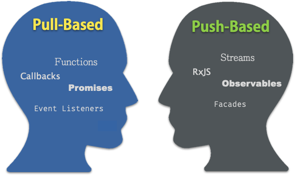

# Avantages de la programmation reactive

## PULL vs PUSH
**Pull-based architecture vs Push-based**

> Most developers learn to program, code, and build software architectures using traditional Pull-based approaches. In the world of web applications and asynchronous, rich user experiences this approach is flawed, rampant with myriad problems, and is fundamentally wrong.

Avec le principe de soumission de données en **push**, un `observer` s'abonne à un **flux de données**.
Ce dernier envoit ensuite les modifications de valeurs, lorsqu'elles adviennent.

## Avantages
### Gestion des états applicatifs
Avec une architecture push, **l'acccès direct aux données est prohibé**. La source de données est mise à disposition via un tiers, qui fournit une API, utilisée par les vues.

Ainsi, **la vue affiche toujours une donnée certifiée à jour**. Elle ne fait que réagir passivement aux modifications de valeurs émises.

### Immutabilité
**Les données soumises sont en lecture seule**. Il n'est pas possible de les modifier directement depuis la vue.

### Vues réactives
1. Les vues de notre interface graphique s'abonnent *passivement* à des flux de données.
Elles se ré-affichent automatiquement lorsque de nouvelles données arrivent via un `push-stream`.

1. Toute la logique est ainsi déplacée et gérée ailleurs. Les inetractions utilsateurs sont déléguées à une couche métier dédiée.

### Référénces
- https://medium.com/@thomasburlesonIA/push-based-architectures-with-rxjs-81b327d7c32d